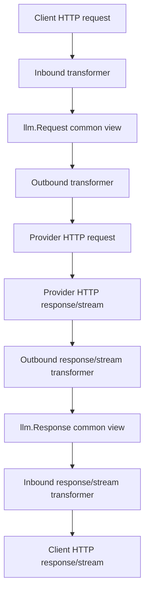

# Design: Clean protocol transformer repair plan

## Objective

Repair verified protocol conversion omissions while preserving AxonHub's existing transformer framework. The design goal is not a new protocol engine. The design goal is to make the existing modules deeper: smaller public seams, clearer field ownership, stronger locality, and targeted tests that prove fields are preserved or explicitly diagnosed.

## Non-goals

- Do not replace `llm.Request` with a full native AST.
- Do not rewrite the pipeline, orchestrator, router, HTTP client, or provider selection logic.
- Do not blindly replay unknown fields across different protocols.
- Do not put stream event fidelity into request models.
- Do not use stale copied protocol docs as implementation truth without tests.
- Do not fix every protocol family in the first implementation slice.

## Author framework to preserve



The existing framework is reasonable because it gives AxonHub one cross-protocol common view while keeping protocol adapters at the edges. The repair should work with this shape.

## Module ownership model

| Module / path | Responsibility | Must not become |
|---|---|---|
| `llm.Request` / `llm.Response` | Stable `CrossProtocolCanonical` semantics: model, messages, common sampling, common function tools, common response content. | Full OpenAI Responses / Chat / Anthropic / provider AST. |
| Protocol native structs | Official fields for that protocol's own HTTP body. | Generic cross-protocol storage. |
| `ProviderExtensions` | Native/provider sidecar data that should not serialize through common fields. | Unstructured dumping ground for every missing field. |
| `TransformerMetadata` | Bridge hints and temporary restoration data with named keys. | Hidden protocol model or silent loss bucket. |
| Raw fallback | Same-protocol unknown/variant preservation. | Cross-protocol passthrough. |
| `LossyDowngrade` diagnostics | Visible record that a source field has no target-protocol equivalent. | Native field storage or semantic mapping engine. |
| Stream event fidelity module | Parse/accumulate/re-emit streaming events. | Request/response field workaround. |

## Field routing rules

1. If a field is stable across protocol families, put it in `llm.Request` / `llm.Response`.
2. If a field is official OpenAI Responses, put it in `llm/transformer/openai/responses` native preservation.
3. If a field is part of Codex's Responses usage profile, treat it as a profile inside OpenAI Responses native preservation, not as a separate private protocol.
4. If a field is official OpenAI Chat, put it in OpenAI Chat native modeling and emit it only where the target adapter supports it.
5. If a field is official/companion Anthropic, keep it in Anthropic native modeling.
6. If a field is provider-specific, keep it near that provider adapter or in provider extensions.
7. If a same-protocol unknown field is safe to preserve, keep it via raw fallback and re-emit only to the same protocol.
8. If a cross-protocol target cannot represent the field, record a `LossyDowngrade` diagnostic and either drop or flatten only with an explicit documented reason.

## Recommended architecture deepening

### 1. OpenAI Responses native preservation module

This is the first implementation target.

Current friction:

- Responses official fields, Codex profile fields, raw item variants, tool variants, `TransformerMetadata`, and `ProviderExtensions` can mix across shallow seams.
- Same-protocol OpenAI Responses routes can accidentally lose fields before any cross-protocol decision is made.
- `passThroughBody` is useful as an operational baseline but does not give structured diagnosis, accounting, or safe downgrade behavior.

Design direction:

- Keep the module inside `llm/transformer/openai/responses`.
- Give it ownership over Responses request native fields, Responses raw fallback, Codex Responses profile fields, and same-protocol re-emission decisions.
- Keep its external seam small: inbound captures native/preservation data; outbound re-emits or diagnoses based on target protocol.
- Do not add these fields to `llm.Request` unless they are stable cross-protocol semantics.

The first implementation slice is frozen here: OpenAI Responses -> OpenAI Responses same-protocol native preservation only. Chat, Anthropic, and stream event fidelity are excluded from this first slice.

Expected P1 field groups:

| Field group | Examples | Handling |
|---|---|---|
| Existing raw tool/input preservation | `tool_search`, `tool_search_call`, `namespace`, raw `tool_choice`, unknown input/tool variants | Already partially implemented upstream via `ProviderExtensions.OpenAIResponses.Request`; preserve tests and do not reimplement. |
| Missing top-level Responses/Codex profile fields | `context_management`, `additional_tools`, `defer_loading`, unknown future top-level keys | Same-protocol raw top-level fallback; do not put in `llm.Request`. |
| Official TODO top-level Responses fields | `prompt`, `conversation` | Prefer typed `responses.Request` fields because upstream already has TODO structs; raw fallback must not override typed output. |

### 2. OpenAI-compatible Chat emission policy module

This is not first because `openai.RequestFromLLM` has many callers.

Current friction:

- `RequestFromLLM` is shared by many OpenAI-compatible adapters.
- Official Chat fields such as `web_search_options`, `prediction`, and top-level `audio` may be valid for OpenAI Chat but unsafe for every compatible provider.
- The current builder filters non-function tools, which may be outdated for modern official Chat behavior.

Design direction:

- Keep common Chat builder behavior for stable shared fields.
- Add a policy seam before provider emission so each adapter can support, diagnose, or drop provider-specific/native fields intentionally.
- Avoid silently emitting unsupported fields to every OpenAI-compatible provider.

### 3. Anthropic native preservation

Current friction:

- Anthropic native/companion fields are not fully represented upstream.
- Anthropic MCP connector fields are different from OpenAI Responses server-side MCP and Codex local MCP.

Design direction:

- Keep Anthropic fields in Anthropic native structs/adapters.
- Preserve fields like `container`, `inference_geo`, and verified MCP companion fields only in Anthropic-native paths unless an explicit cross-protocol mapping exists.

### 4. LossyDowngrade diagnostics module

Current friction:

- Drop/flatten decisions are scattered.
- Users cannot tell whether a field was unsupported, deliberately dropped, or accidentally lost.

Design direction:

- Add a central diagnostic vocabulary for cross-protocol loss.
- Record source protocol, source field, target protocol, reason, and severity.
- Keep diagnostics separate from native preservation storage.

### 5. Stream event fidelity module

Current friction:

- Stream handling is high-complexity and separate from request field preservation.
- OpenAI Responses has many stream event types; request fixes will not preserve those events by themselves.

Design direction:

- Treat stream event parse/accumulate/re-emit as its own module per protocol.
- Keep external transformer stream seam stable.
- Test complete event fixtures through one seam.

## Implementation order

1. Baseline sync with upstream latest and preserve upstream Codex header behavior.
2. OpenAI Responses same-protocol native preservation only. This is the frozen first implementation scope.
3. OpenAI Chat same-protocol/native emission policy.
4. Anthropic same-protocol native preservation.
5. Cross-protocol `LossyDowngrade` diagnostics.
6. Stream event fidelity slices.

## Compatibility and migration notes

- Existing provider behavior should remain unchanged unless a slice explicitly targets that provider/protocol path.
- Raw fallback must only re-emit to the same protocol family unless a documented adapter explicitly supports the field.
- `TransformerMetadata` keys should be named constants where used; new unstructured magic strings should be avoided.
- Provider extensions should be narrowed by ownership; do not expand them without a field-routing reason.
- Upstream `e412fab1` Codex header behavior is part of the baseline and must survive conflict resolution.


## Parent task vertical slice loop

The repair is a parent task made of vertical slices. Each vertical slice must pass through the same gates before the next slice starts:

1. TDD for one field group and one preserve-or-diagnose behavior.
2. Trellis check for spec compliance and slice boundaries. In current inline mode this is performed by the main session; in sub-agent mode it may be delegated to a check agent.
3. Matt code-review for bugs, code quality, architecture drift, useless code, dead code, and unnecessary abstraction.
4. Gate decision: failure returns to TDD, diagnosing-bugs, or planning for the same slice; success unlocks the next slice.

After all frozen OpenAI Responses preservation slices pass, run final parent review and an overall architecture review. Only then update durable specs, ADRs, or CONTEXT and move to the next module.

## Verification strategy

Each slice must prove one of these outcomes for each field under test:

1. same-protocol preserve: input field survives to same-protocol output;
2. cross-protocol map: input field maps to a documented equivalent;
3. diagnostic drop: input field cannot map and a visible diagnostic records why;
4. deliberate unsupported: field is intentionally unsupported and documented.

Targeted tests should be run only for touched packages unless broader validation is explicitly requested.

## Risk controls

- No broad lint/build/test unless requested.
- No server restart.
- Keep upstream clone unchanged for comparison.
- Before each code slice, compare touched files against `/Users/asuan/项目/AI/axonhub-worktrees/upstream-unstable`.
- Keep each slice independently revertible.

## 2026-07-06 upstream reread correction

Authoritative upstream baseline is now:

```text
/Users/asuan/项目/AI/axonhub-worktrees/upstream-unstable
HEAD: 97c9351a
```

See:

```text
.trellis/tasks/07-06-upstream-protocol-transformer-audit/research/upstream-architecture-reread-2026-07-06.zh.md
```

Correction to earlier plan:

- `tool_search`, `tool_search_call`, `namespace`, raw `tool_choice` inside tools/input/tool_choice are already partially preserved in upstream through `ProviderExtensions.OpenAIResponses.Request` and `request_extensions.go`.
- The real first missing slice is top-level Responses preservation: `prompt`, `conversation`, `context_management`, `additional_tools`, `defer_loading`, and future unknown top-level fields.
- Do not reimplement existing raw tool/input replay.
- Keep changes inside the existing author seam: `ProviderExtensions.OpenAIResponses.Request` plus `responses/request_extensions.go` marshal merge.

## Final execution contract — clean upstream implementation

This task must be implemented from the author's upstream clean baseline, not from the current polluted branch.

Authoritative code baseline:

```text
origin/unstable
/Users/asuan/项目/AI/axonhub-worktrees/upstream-unstable
```

Current branch `codex-transformer-field-fixes` is research/reference only. Its business-code changes must not be used as the implementation base because they were influenced by older OpenRouter-style conversion assumptions and broad cross-protocol edits.

### Final acceptance standard

The final implementation must:

- preserve or explicitly diagnose all OpenAI Responses, OpenAI Chat, and Anthropic field ownership decisions recorded in the verified field matrix;
- keep protocol-specific fields out of `llm.Request` unless they are proven stable cross-protocol semantics;
- stop expanding `TransformerMetadata` as a magic-key protocol field bus;
- keep same-protocol native/raw preservation separate from cross-protocol lossy downgrade;
- preserve the author's main transformer architecture unless an architecture review proves a deeper module is needed;
- be readable, testable, and maintainable, with no dead code, duplicate conversion layers, or hidden field ownership;
- prefer the smallest change inside the author's framework unless additional code clearly improves locality, leverage, testability, and future maintainability.

### Required slice workflow

For each small vertical slice:

1. Write focused failing tests first.
2. Implement the smallest architecture-aligned change.
3. Run a self-review checklist against the field matrix and architecture report.
4. If self-review fails, return to TDD/debug before moving on.

For each module after several small slices are complete:

1. Trigger code-review.
2. Trigger improve-codebase-architecture.
3. Trigger multi-agent cross-review for bugs, code quality, architecture drift, dead code, and spec compliance.
4. If any review fails, read the review report, fix the issues, and return to the relevant TDD/debug slice.
5. Only after all reviews pass, git-archive/commit the module before entering the next module.

### Module order

1. OpenAI Responses request preservation.
2. OpenAI Responses response/stream fidelity.
3. OpenAI Chat native emission policy.
4. Anthropic native preservation and MCP connector fields.
5. Cross-protocol lossy downgrade diagnostics.
6. FieldOwnershipTable/spec hardening and final architecture review.

### First module slices

P1 OpenAI Responses request preservation:

- P1a: top-level raw fallback for `context_management`, future unknown top-level fields, and verified profile top-level fields such as `additional_tools` / `defer_loading` if present.
- P1b: typed TODO fields `prompt` and `conversation`.
- P1c: regression protection for upstream's existing raw `tools` / `tool_choice` / `input` replay (`tool_search`, `tool_search_call`, `namespace`, raw tool choice, unknown tool/input variants).

P1 must not modify Chat, Anthropic, stream fidelity, shared lossy downgrade, or unrelated provider adapters.

