# Architecture audit: upstream latest vs current branch

Generated: 2026-07-06

## Baseline

| Item | Value |
|---|---|
| Current repo | `/Users/asuan/项目/AI/axonhub` |
| Current branch | `codex-transformer-field-fixes` |
| Current HEAD | `c798c6e9e206e4d6ca44cae49c3d586e4e23c962` |
| Upstream remote | `https://github.com/looplj/axonhub.git` |
| Upstream branch | `unstable` |
| Upstream latest | `97c9351a23df5a3c302cf1c35bf5ca39caf7208f` |
| Upstream clone | `/tmp/axonhub-upstream-20260706-175405` |
| Merge base | `6831e03ce7cf1efbc3eb4d2e2eb84bf0cb1722a3` |

Evidence files:

- `git-comparison.md`
- `native-struct-field-comparison.md`
- `requestfromllm-callers.txt`
- `upstream-transformer-flow-source-notes.txt`
- `diff-*.patch`

## What changed upstream after our branch point

Upstream has 7 commits not in the current branch:

1. `0ad31228 fix(httpclient): cap upstream error response body at 1 MB (#1955)`
2. `07d464fc feat: ip access control (#1956)`
3. `91b0f39a chore: remove the test source filter for request, close #1913 (#1957)`
4. `84344a5f feat: show reasoning token usage (#1960)`
5. `e412fab1 feat: add codex headers (#1963)`
6. `3da59d10 chore: sync model developers data (#1964)`
7. `97c9351a ci: publish Helm chart to GHCR --issue=#1965 (#1966)`

The Codex-related upstream commit matters: `e412fab1` changes Codex outbound headers:

- adds `Session-Id` hyphen header support;
- avoids leaking underscore `Session_id` upstream;
- sets `Conversation_id` from session id if missing;
- sets default `Version = 0.142.5`.

So any Codex/Responses repair must first account for upstream latest, not the older local base.

## Author's underlying transformer design

The author's design is not “one native protocol AST per provider”. It is a two-stage bridge:

```mermaid
flowchart LR
  Client[Client HTTP protocol] --> Inbound[Inbound transformer]
  Inbound --> Common[llm.Request / llm.Response]
  Common --> Outbound[Outbound transformer]
  Outbound --> Provider[Provider HTTP protocol]
  Provider --> OutboundResp[Outbound response transformer]
  OutboundResp --> CommonResp[llm.Response]
  CommonResp --> InboundResp[Inbound response transformer]
  InboundResp --> ClientResp[Client HTTP response]
```



Important interfaces from upstream `llm/transformer/interfaces.go`:

- `Inbound.TransformRequest`: HTTP request -> `llm.Request`.
- `Outbound.TransformRequest`: `llm.Request` -> provider HTTP request.
- `TransformStream` / `AggregateStreamChunks`: provider/client stream conversion and persistence aggregation.

### `llm.Request` role

`llm.Request` is deliberately chat-centric. Its own comment says it is based on OpenAI Chat Completion request plus extra fields. It is the cross-protocol common carrier, not a complete representation of every protocol's native request body.

Field extraction confirms upstream and current both have the same 47 `llm.Request` fields. The local branch did not expand `llm.Request`; local changes instead added fields to native protocol structs and sidecars.

### OpenAI-compatible Chat path

Upstream `llm/transformer/openai/outbound_convert.go::RequestFromLLM` is a shared builder for OpenAI-compatible Chat-style providers. Graph/literal evidence shows it is called by:

- OpenAI Chat outbound;
- OpenRouter outbound;
- Doubao outbound;
- DeepSeek outbound;
- Moonshot outbound;
- Zai outbound;
- Copilot outbound;
- Gemini OpenAI-compatible outbound.

Therefore changes to this function are high-risk and must be provider-aware.

Upstream explicitly filters tools to function tools only:

```go
req.Tools = lo.FilterMap(r.Tools, func(t llm.Tool, _ int) (Tool, bool) {
    return ToolFromLLM(t), t.Type == llm.ToolTypeFunction
})
```

This was likely correct for an older “Chat Completions means function tools only” mental model, but current OpenAI Chat docs now include custom tools and web/search-related options. This is a verified protocol drift risk.

### OpenAI Responses path

Upstream has a dedicated `llm/transformer/openai/responses` package. It already preserves some Responses-only material through `ProviderExtensions.OpenAIResponses.Request`:

- raw-only tools;
- represented tool signatures;
- raw unsupported `tool_choice`;
- raw-only input items.

This means the author's framework already has a native-preservation sidecar pattern for Responses. The clean repair should extend this pattern carefully rather than replacing the transformer system.

Current local branch expands this sidecar significantly:

- `ClientMetadata`
- `RawTopLevelFields`
- `NativeTools`
- `AdditionalTools`
- `PrependCount`

This may be useful, but it also increases architecture ambiguity because native fields, raw unknown top-level fields, and diagnostics are all being merged from `request_extensions.go`.

### Anthropic path

Upstream `MessageRequest` models the main Claude Messages request fields:

- `max_tokens`, `messages`, `model`, version/beta headers, sampling fields, metadata, service tier, system, thinking, output_config, tools, tool_choice, stream, cache_control.

Current local branch adds `ContextManagement` as opaque raw JSON. This follows the same “native field + opaque passthrough for versioned schema” pattern and is likely aligned with the author's framework if limited to Anthropic native same-protocol preservation.

## Current local branch differences

See `native-struct-field-comparison.md`. Summary:

| Area | Upstream | Current branch | Interpretation |
|---|---:|---:|---|
| `llm.Request` | 47 fields | 47 fields | Common carrier unchanged. Good: no full native AST stuffed into common request. |
| OpenAI Chat native `Request` | 30 fields | 36 fields | Local adds provider/native knobs: `TopK`, `RepetitionPenalty`, `MinP`, `TopA`, `CacheControl`, `Reasoning`. Needs review because shared builder affects many providers. |
| OpenAI Responses native `Request` | 26 fields | 33 fields | Local adds `ClientMetadata`, `CacheControl`, penalties, `Prompt`, `TopK`, `Modalities`. Needs field-by-field validation against official Responses docs and actual Codex behavior. |
| Anthropic `MessageRequest` | 18 fields | 19 fields | Local adds `ContextManagement`. Likely legitimate but must be constrained to Anthropic native. |
| Responses provider extension | 4 fields | 9 fields | Local greatly expands sidecar. Useful but risk of patch-layer growth. |

## Verified omissions / protocol drift in upstream

These are not final code-change approvals; they are verified audit candidates.

### 1. Chat custom tools / modern Chat fields

Evidence:

- Upstream Chat native `Request` has no `web_search_options` field.
- Upstream `RequestFromLLM` filters tools to `ToolTypeFunction` only.
- Current protocol docs saved under `docs/specs/protocols/openai-chat-completions-protocol.md` list current Chat fields such as custom tools and `web_search_options`.

Risk:

- Same-protocol Chat -> Chat can drop or fail to express newer Chat-native tool/options fields.
- Because `RequestFromLLM` is shared by many OpenAI-compatible providers, a naive fix can break providers that do not support these fields.

Clean direction:

- Add explicit native fields to OpenAI Chat request model only when verified.
- Preserve same-protocol unknown/raw Chat fields either via `ExtraBody`/raw body merge or a small Chat-native provider extension, not by polluting `llm.Request`.
- Gate provider-specific emission when providers are known not to support the field.

### 2. Responses `conversation` and `context_management`

Evidence:

- Upstream Responses `Request` has `Conversation *Conversation` commented out, not active.
- Upstream Responses `Request` has no `context_management` field.
- Upstream response model does include response-side `Conversation`, which confirms the concept exists in the package but request-side handling is incomplete.

Risk:

- If a Responses client sends these request fields, upstream branch cannot structurally represent them. It may only preserve raw fragments if a raw top-level fallback exists. Upstream fallback is limited to tools/tool_choice/input raw fragments, not arbitrary top-level fields.

Clean direction:

- Add request-side native fields for official Responses fields with minimal opaque types where schema is versioned: e.g. `Conversation json.RawMessage` or a flexible string/object wrapper, `ContextManagement json.RawMessage` or typed minimal struct.
- Keep same-protocol round-trip first. Cross-protocol downgrade must be explicit diagnostics, not silent mapping.

### 3. Responses tool/input raw preservation is real but incomplete

Evidence:

- Upstream `request_extensions.go` already captures raw-only tools, raw unsupported tool_choice, raw-only input items.
- Current branch adds `NativeTools`, `AdditionalTools`, `RawTopLevelFields`, diagnostics, and prepend offset handling.

Risk:

- The current additions may be addressing real Codex lazy-tool problems, but the code path is becoming a patch layer inside `request_extensions.go` rather than a clean native request preservation boundary.

Clean direction:

- Keep the author's sidecar pattern, but define the sidecar responsibilities:
  - native struct fields for official known fields;
  - raw fragments for known but structurally unmodeled item/tool variants;
  - raw top-level unknowns only for same-protocol passthrough;
  - diagnostics for fields lost in cross-protocol downgrade.

### 4. Anthropic native companion fields

Evidence:

- Upstream `MessageRequest` has no `mcp_servers`, `container`, `inference_geo` fields.
- Current branch adds only `ContextManagement`.

Risk:

- Claude same-protocol requests using current Anthropic MCP connector/container features may lose fields.

Clean direction:

- Add opaque native fields for provider-native request fields that lack common equivalents.
- Do not map Anthropic `mcp_servers` to OpenAI Responses `mcp` automatically; these are related concepts but not the same schema.

## Likely polluted local areas

“Polluted” here means introduced during earlier repair attempts before the source-of-truth protocol baseline and upstream latest comparison were complete.

| Area | Why suspicious | Keep/rework decision |
|---|---|---|
| `docs/specs/vendor/openai/codex-source/*` committed docs | Huge copied Codex source/manual snapshots were committed before the latest canonical protocol baseline was rebuilt. | Do not use as source of truth for generic OpenAI protocol. Keep only if explicitly needed as Codex-client evidence. |
| `docs/specs/protocols/*` uncommitted docs | Recently regenerated from canonical sources; useful, but should be treated as audit input, not implementation authority without tests. | Keep as reference after review. |
| `ProviderExtensions.OpenAIResponses.Request.NativeTools` | Broad raw-native replay may preserve too much and bypass structural model. | Rework into narrower sidecar contract if tests show over-preservation. |
| `RawTopLevelFields` | Useful for same-protocol passthrough; dangerous if blindly merged after cross-protocol transforms. | Keep only with same-protocol/source-format guard and diagnostics. |
| Metadata-key proliferation | Many fields restored through `TransformerMetadata`; this matches author pattern in places but can become implicit schema. | Consolidate constants and document ownership per protocol. |
| Shared `openai.RequestFromLLM` additions | High blast radius across OpenAI-compatible providers. | Keep only provider-neutral fields; provider-specific fields should be handled near provider outbound. |

## Recommended architectural stance

Preserve the author's main architecture:

1. `llm.Request` remains the cross-protocol common view.
2. Protocol native structs carry official native fields for same-protocol fidelity.
3. ProviderExtensions carry protocol-private sidecars that should not serialize as common JSON.
4. `TransformerMetadata` carries bridge metadata, but only with named constants and ownership.
5. Cross-protocol conversion is allowed to be lossy, but loss must be explicit and test-covered.

Do not build a new full AST framework before first stabilizing the existing pattern.
