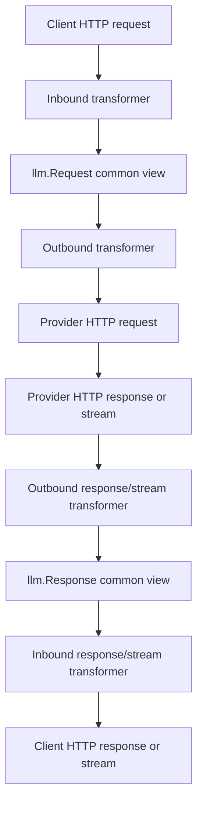

# Field coverage and author's conversion handling summary

Generated: 2026-07-06

## Did we list all fields?

No, not literally all fields across request + response + stream.

Current completed matrix is request-side focused:

- `docs/specs/protocols/hub-protocol-field-matrix.md`
- scope: OpenAI Responses request, OpenAI Chat Completions request, Anthropic Claude Messages request
- includes field meaning, whether Hub has it, and broad same/cross protocol behavior

Not yet fully listed:

- response object fields
- streaming event fields
- every nested content-block variant
- every provider-specific extension field outside the three canonical protocol request bodies
- every frontend/config/provider registry field

Current native struct field extraction is complete only for the inspected top-level request structs:

- `llm.Request`
- OpenAI Chat `Request`
- OpenAI Responses `Request`
- Anthropic `MessageRequest`
- `OpenAIResponsesRequestExtensions`

## What is missing in author's upstream code?

Confirmed from upstream `97c9351a` vs current protocol docs / current branch audit.

### OpenAI Chat Completions request

Upstream native `llm/transformer/openai/model.go::Request` lacks confirmed modern/native fields such as:

- `web_search_options`
- `prompt_cache_retention`
- `prediction`
- top-level request `audio` option for modalities/audio output control, distinct from message `audio`
- broader custom tool handling in outbound builder

Important nuance: upstream message structs already contain audio content/message fields, but top-level request option coverage is not complete.

Upstream `RequestFromLLM` also filters tools to function tools only. This is an implementation omission / protocol drift if modern Chat custom tools should be preserved.

### OpenAI Responses request

Upstream native `llm/transformer/openai/responses/model.go::Request` lacks or disables:

- request-side `conversation` is present only as commented-out field
- `context_management` is absent
- `client_metadata` is absent from upstream request struct
- `cache_control` absent from upstream request struct
- `frequency_penalty` absent from upstream Responses request struct
- `presence_penalty` absent from upstream Responses request struct
- `prompt` absent from upstream request struct
- `top_k` absent from upstream request struct
- `modalities` absent from upstream request struct

Some of these may be provider/Codex compatibility fields rather than public OpenAI baseline. They require source classification before implementation.

### Anthropic Claude Messages request

Upstream native `llm/transformer/anthropic/model.go::MessageRequest` lacks:

- `context_management`
- `mcp_servers`
- `container`
- `inference_geo`

Current local branch only adds `ContextManagement`.

### Provider extension / raw preservation

Upstream `OpenAIResponsesRequestExtensions` only has:

- `RawTools`
- `ToolSignatures`
- `RawToolChoice`
- `RawInputItems`

Current branch adds:

- `ClientMetadata`
- `RawTopLevelFields`
- `NativeTools`
- `AdditionalTools`
- `PrependCount`

These additions address real preservation classes, but need boundary cleanup.

## Author's architecture

The author's architecture is a common-model bridge, not a full-native AST architecture.

Core interface files:

- `llm/transformer/interfaces.go`
- `internal/server/orchestrator/inbound.go`
- `internal/server/orchestrator/outbound.go`

Core design idea:

- `llm.Request` is the cross-protocol common subset, chat-centric by author comment.
- Each protocol has native structs for its HTTP format.
- Inbound parses client-native request into `llm.Request`.
- Outbound emits provider-native HTTP request from `llm.Request`.
- Stream aggregation can reconstruct provider/client complete bodies for persistence.

## How does the author handle field conversion?

There are several distinct mechanisms, not one.

### 1. Direct common-field mapping through `llm.Request`

Used for fields common enough across providers:

- `model`
- `messages`
- `temperature`
- `top_p`
- `max_tokens` / `max_completion_tokens`
- `stream`
- `tools` basic function tools
- `tool_choice` basic forms
- `metadata`
- `user`
- `service_tier`
- `reasoning_effort` / related common reasoning shorthand

Files:

- `llm/model.go`
- `llm/transformer/openai/inbound_convert.go`
- `llm/transformer/openai/outbound_convert.go`
- `llm/transformer/anthropic/inbound_convert.go`
- `llm/transformer/anthropic/outbound_convert.go`
- `llm/transformer/openai/responses/inbound.go`
- `llm/transformer/openai/responses/outbound.go`

### 2. Protocol-native struct fields

Used when the target protocol supports the field in its own request body.

Examples:

- OpenAI Chat `Request` in `llm/transformer/openai/model.go`
- Responses `Request` in `llm/transformer/openai/responses/model.go`
- Anthropic `MessageRequest` in `llm/transformer/anthropic/model.go`

This is the cleanest place for official native fields.

### 3. `TransformerMetadata`

Used for conversion hints / fields not present in `llm.Request` but needed to restore later.

Examples from current/local and upstream patterns:

- include / max_tool_calls / truncation-like Responses hints
- Anthropic thinking/output_config/cache_control hints
- top_k / cache_control shared metadata in local branch

Risk:

- too many implicit keys become a hidden schema.

Good rule:

- use named constants;
- document owner protocol;
- do not use it as a dumping ground for every native field.

### 4. `ProviderExtensions`

Used for protocol/API-format-private data that should not serialize through `llm.Request`.

Upstream already uses this for OpenAI Responses raw preservation:

- raw-only tools
- tool signatures
- raw tool_choice
- raw input items

This is the author's existing native-preservation sidecar pattern.

Good extension direction:

- keep official known fields in native structs;
- keep raw fragments for known but structurally unmodeled variants;
- keep raw top-level fallback only for same-protocol passthrough.

### 5. Raw fragment fallback

Used when the transformer cannot structurally model a native item/tool variant but wants same-protocol round-trip preservation.

Upstream Responses already does this for:

- raw-only tool fragments
- raw-only input fragments
- raw unsupported tool_choice

Risk:

- raw fallback must not silently cross protocol families.

### 6. Explicit filtering / intentional drop

The author also intentionally drops unsupported fields in some conversions.

Example:

- `openai.RequestFromLLM` filters tools to function tools only for Chat Completions.

This is a design choice, but some choices are now stale due to protocol drift.

### 7. Provider-specific outbound adaptation

OpenAI-compatible providers sometimes call the shared OpenAI Chat builder, then adjust request details in their own outbound transformer.

Affected providers include:

- OpenAI
- OpenRouter
- Doubao
- DeepSeek
- Moonshot
- Zai
- Copilot
- Gemini OpenAI-compatible path

Therefore provider-specific fields should usually be handled near the provider outbound layer unless safe for all shared callers.

### 8. Stream aggregation reconstruction

For streaming, the author does not only pass chunks through. The transformer can aggregate stream chunks into a complete provider/client response body for persistence.

Files:

- `llm/transformer/openai/aggregator.go`
- `llm/transformer/openai/responses/aggregator.go`
- `llm/transformer/anthropic/aggregator.go`
- orchestrator persistent stream code

This is a separate response/stream field-handling layer and is not fully covered by the request-side matrix yet.

## Bottom line

- Request-side important fields are listed; literally all response/stream/nested fields are not yet listed.
- The author's architecture is common-model bridge + protocol native structs + sidecars, not a full native AST framework.
- The author handles fields through at least eight mechanisms: common mapping, native structs, metadata, provider extensions, raw fallback, intentional filtering/drop, provider-specific outbound adaptation, and stream aggregation.
- The clean fix should preserve these mechanisms but tighten ownership and add missing native fields/tests.
