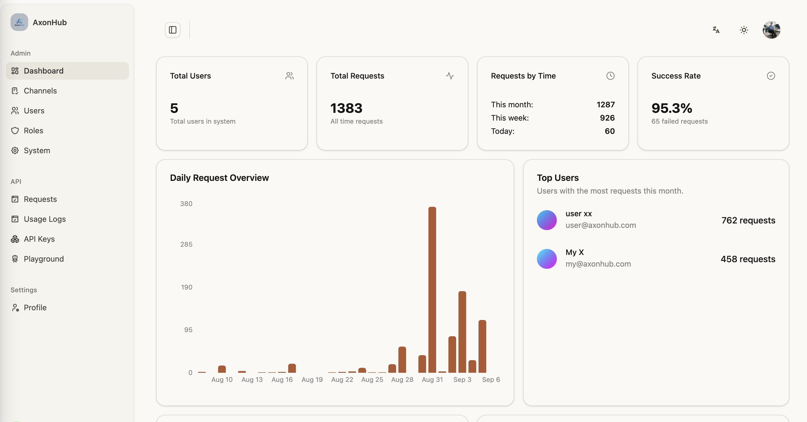
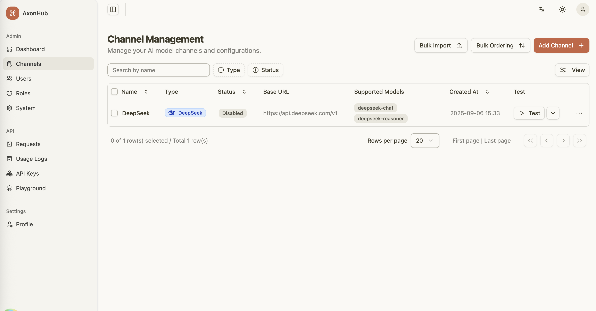
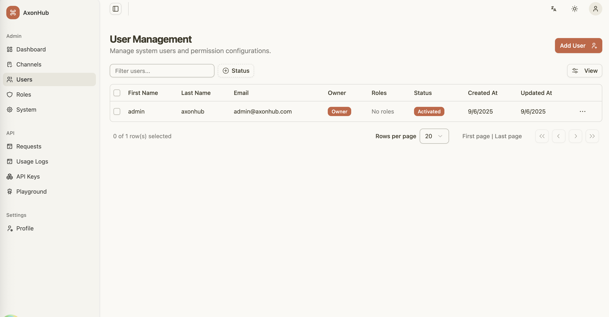
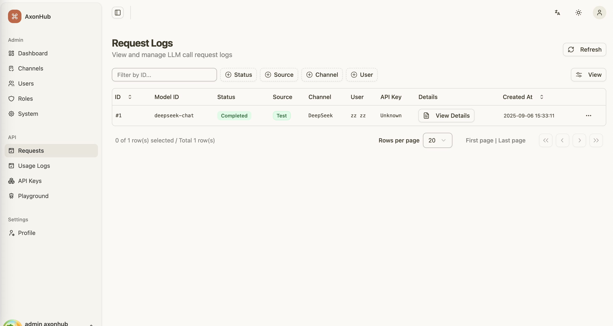
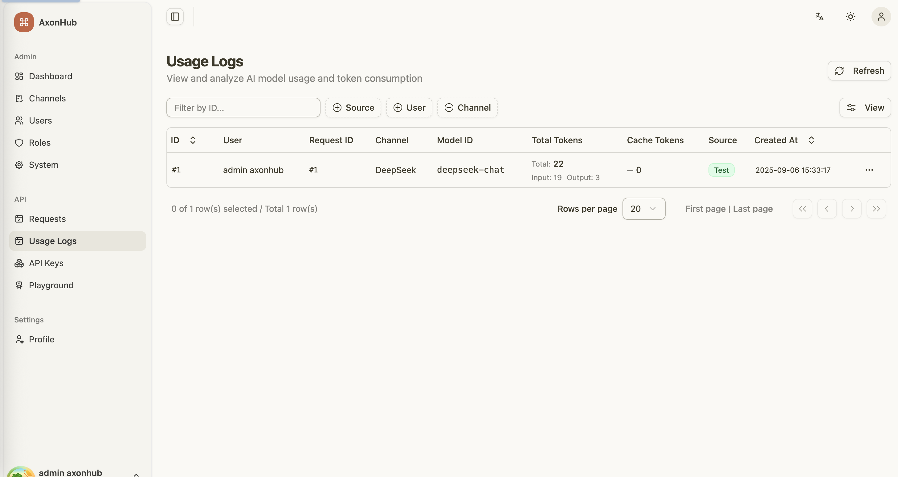
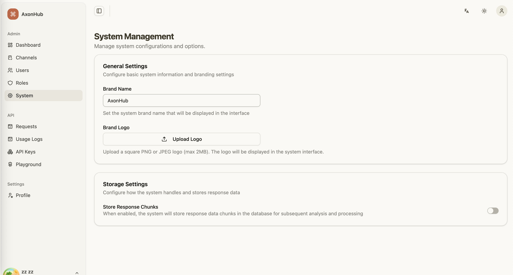

<div align="center">

# AxonHub - Unified AI Gateway System

</div>

<div align="center">

[](https://github.com/looplj/axonhub/actions/workflows/test.yml)
[](https://github.com/looplj/axonhub/actions/workflows/lint.yml)
[](https://golang.org/)
[](https://opensource.org/licenses/MIT)
[](https://docker.com)

[English](README.md) | [中文](README.zh-CN.md)

</div>

---

## 📖 Project Introduction

### Unified AI Gateway

AxonHub is a modern AI gateway system that provides a unified OpenAI, Anthropic, and AI SDK compatible API layer, transforming requests to various AI providers through a transformer pipeline architecture. The system features comprehensive tracing capabilities, helping enterprises better manage and monitor AI service usage. It also includes comprehensive test coverage to ensure system stability and reliability.

### Core Problems Solved

| Problem | AxonHub Solution |
|-------------|-------------------------|
| **Vendor Lock-in** | 🔄 Unified API interface, switch providers anytime |
| **Extensibility** | Flexible transformer architecture, supports multiple transformers |
| **Service Outages** | ⚡ Automatic failover, multi-channel redundancy |
| **Cost Control** | 💰 Intelligent routing, cost optimization strategies |
| **Permission Management** | 📊 Comprehensive user permission management |
| **Development Complexity** | 🛠️ Single SDK, unified interface standard |

---

## 📚 Documentation

### DeepWiki
For detailed technical documentation, API references, architecture design, and more, please visit [AxonHub DeepWiki](https://deepwiki.com/looplj/axonhub).

---

## 🎯 Demo

Try AxonHub live at our [demo instance](https://axonhub.onrender.com)!

### Demo Account
- **Email**: demo@example.com
- **Password**: 123456

---

## ⭐ Core Features

### 📸 Screenshots

Here are some screenshots of AxonHub in action:

<table>
  <tr>
    <td align="center">
      <a href="screenshots/axonhub-dashboard.png">
        
      </a>
      <br/>
      System Dashboard
    </td>
    <td align="center">
      <a href="screenshots/axonhub-channels.png">
        
      </a>
      <br/>
      Channel Management
    </td>
    <td align="center">
      <a href="screenshots/axonhub-users.png">
        
      </a>
      <br/>
      User Management
    </td>
  </tr>
  <tr>
    <td align="center">
      <a href="screenshots/axonhub-requests.png">
        
      </a>
      <br/>
      Request Monitoring
    </td>
    <td align="center">
      <a href="screenshots/axonhub-ussge-logs.png">
        
      </a>
      <br/>
      Usage Logs
    </td>
    <td align="center">
      <a href="screenshots/axonhub-system.png">
        
      </a>
      <br/>
      System Setting
    </td>
  </tr>
</table>

---

### 🚀 Supported Features

| Feature | Status | Description |
|---------|--------|-------------|
| **Chat Completion** | ✅ Done | Conversational interface |
| **Image Generation** | 📝 Planning | Image generation |
| **Rerank** | 📝 Todo | Results ranking |
| **Embedding** | 📝 Todo | Vector embedding generation |
| **Realtime** | 📝 Todo | Live conversation capabilities |

---

### 🌐 Multi-Provider AI Gateway

| Feature | Technical Implementation | Business Value |
|-------------|----------------------|---------------------|
| **Unified API Interface** | OpenAI compatible standard, zero learning curve | Avoid vendor lock-in, reduce migration risk |
| **Intelligent Routing** | Bidirectional transformer architecture, millisecond-level switching | 99.9% availability guarantee, business continuity |
| **Automatic Failover** | Multi-channel retry + load balancing | Service interruption time < 100ms |
| **Stream Processing** | Native SSE support, real-time response | 60% user experience improvement |

---

### 🔧 API Format Support

| Format | Status | Compatibility | Notes |
|-------------|------------|---------------------|----------|
| **OpenAI API** | ✅ Done | Fully compatible | Chat/Completions API |
| **Anthropic API** | ✅ Done | Fully supported | Claude Messages API |
| **AI SDK** | ⚠️ Partial | Partially supported | Vercel AI SDK format |
| **More Formats** | 🔄 Ongoing | Continuously added | New API format support |

---

### 🤖 Supported Providers

| Provider | Status | Supported Models | Notes |
|---------------|------------|---------------------------|----------|
| **OpenAI** | ✅ Done | GPT-4, GPT-4o, GPT-5, etc. | Fully supported, including streaming responses |
| **Anthropic** | ✅ Done | Claude 4.0, Claude 4.1, etc. | Fully supported, including chain of thought |
| **Zhipu AI** | ✅ Done | GLM-4.5, GLM-4.5-air, etc. | Fully supported |
| **Moonshot AI (Kimi)** | ✅ Done | kimi-k2, etc. | Fully supported |
| **DeepSeek** | ✅ Done | DeepSeek-V3.1, etc. | Fully supported |
| **ByteDance Doubao** | ✅ Done | doubao-1.6, etc. | Fully supported |
| **AWS Bedrock** | 🔄 Testing | Claude on AWS | Access via Bedrock |
| **Google Cloud** | 🔄 Testing| Claude on GCP | Access via Vertex AI |
| **Gemini** | 📝 Todo | Gemini 2.5, etc. | Not implemented |

---

### 🏢 Permission Control

| Security Feature | Implementation |   
|-----------------|----------------------|
| **Fine-grained Permission Control** | Role-based access control (RBAC) |
| **Data Localization** | Configurable data storage policies |
| **API Key Management** | JWT + scope control |

---


## 🚀 Quick Start

### 1-click Deploy to Render

Deploy AxonHub with 1-click on [Render](https://render.com) for free.

<div>

<a href="https://render.com/deploy?repo=https://github.com/looplj/axonhub">
  
</a>

</div>

---

## 🚀 Deployment Guide

### 💻 Personal Computer Deployment

Perfect for individual developers and small teams. No complex configuration required.

#### Quick Download & Run

1. **Download the latest release** from [GitHub Releases](https://github.com/looplj/axonhub/releases)
   - Choose the appropriate version for your operating system:

2. **Extract and run**
   ```bash
   # Extract the downloaded file
   unzip axonhub_*.zip
   cd axonhub_*
   
   # Add execution permissions (only for Linux/macOS)
   chmod +x axonhub
  
   # Run directly - default SQLite database
   # Install AxonHub to system
   ./install.sh

   # Start AxonHub service
   ./start.sh

   # Stop AxonHub service
   ./stop.sh
   ```

3. **Access the application**
   ```
   http://localhost:8090
   ```

---

### 🖥️ Server Deployment

For production environments, high availability, and enterprise deployments.

#### Database Support

AxonHub supports multiple databases to meet different scale deployment needs:

| Database | Supported Versions | Recommended Scenario | Auto Migration | Links |
|--------|----------|----------|----------|------|
| **SQLite** | 3.0+ | Development environment, small deployments | ✅ Supported | [SQLite](https://www.sqlite.org/index.html) |
| **TiDB Cloud** | Starter | Serverless, Free tier, Auto Scale | ✅ Supported | [TiDB Cloud](https://www.pingcap.com/tidb-cloud-starter/) |
| **TiDB Cloud** | Dedicated | Distributed deployment, large scale | ✅ Supported | [TiDB Cloud](https://www.pingcap.com/tidb-cloud-dedicated/) |
| **TiDB** | V8.0+ | Distributed deployment, large scale | ✅ Supported | [TiDB](https://tidb.io/) |
| **Neon DB** | - | Serverless, Free tier, Auto Scale | ✅ Supported | [Neon DB](https://neon.com/) |
| **PostgreSQL** | 15+ | Production environment, medium-large deployments | ✅ Supported | [PostgreSQL](https://www.postgresql.org/) |
| **MySQL** | 8.0+ | Production environment, medium-large deployments | ✅ Supported | [MySQL](https://www.mysql.com/) |

#### Configuration

AxonHub uses YAML configuration files with environment variable override support:

```yaml
# config.yml
server:
  port: 8090
  name: "AxonHub"
  debug: false

db:
  dialect: "tidb"
  dsn: "<USER>.root:<PASSWORD>@tcp(gateway01.us-west-2.prod.aws.tidbcloud.com:4000)/axonhub?tls=true"

log:
  level: "info"
  encoding: "json"
```

Environment variables:
```bash
AXONHUB_SERVER_PORT=8090
AXONHUB_DB_DIALECT="tidb"
AXONHUB_DB_DSN="<USER>.root:<PASSWORD>@tcp(gateway01.us-west-2.prod.aws.tidbcloud.com:4000)/axonhub?tls=true"
AXONHUB_LOG_LEVEL=info
```

For detailed configuration instructions, please refer to [configuration documentation](config.example.yml).

#### Docker Compose Deployment

```bash
# Clone project
git clone https://github.com/looplj/axonhub.git
cd axonhub

# Set environment variables
export AXONHUB_DB_DIALECT="tidb"
export AXONHUB_DB_DSN="<USER>.root:<PASSWORD>@tcp(gateway01.us-west-2.prod.aws.tidbcloud.com:4000)/axonhub?tls=true"

# Start services
docker-compose up -d

# Check status
docker-compose ps
```

#### Virtual Machine Deployment

```bash
# Clone project
git clone https://github.com/looplj/axonhub.git
cd axonhub

# Set environment variables
export AXONHUB_DB_DIALECT="tidb"
export AXONHUB_DB_DSN="<USER>.root:<PASSWORD>@tcp(gateway01.us-west-2.prod.aws.tidbcloud.com:4000)/axonhub?tls=true"

# Build
make build

# Configuration file check
./axonhub config check

# Start service
./axonhub 
```

#### Process Management

For simplicity, we recommend managing AxonHub with the helper scripts:

```bash
# Start
./deploy/start.sh

# Stop
./deploy/stop.sh
```

---

## 📖 Usage Guide

### 1. Initial Setup

1. **Access Management Interface**
   ```
   http://localhost:8090
   ```

2. **Configure AI Providers**
   - Add API keys in the management interface
   - Test connections to ensure correct configuration

3. **Create Users and Roles**
   - Set up permission management
   - Assign appropriate access permissions

### 2. Channel Configuration

Configure AI provider channels in the management interface:

```yaml
# OpenAI channel example
name: "openai"
type: "openai"
base_url: "https://api.openai.com/v1"
credentials:
  api_key: "your-openai-key"
supported_models: ["gpt-5", "gpt-4o"]
```

#### 2.1 Test Connection

Click the test button. If the test is successful, the configuration is correct.

#### 2.2 Enable Channel

After successful testing, click the enable button to activate the channel.

### 3. Add Users

1. Create user accounts
2. Assign roles and permissions
3. Generate API keys


### 4. Claude Code Integration

Using AxonHub in Claude Code:

```bash
# Set Claude Code to use AxonHub
export ANTHROPIC_API_KEY="your-axonhub-api-key"
export ANTHROPIC_BASE_URL="http://localhost:8090/anthropic"
```

#### 4.1. Model Profiles Feature


AxonHub introduces a powerful model profiles feature that allows you to configure multiple model mapping profiles for your API keys. This feature is particularly useful for scenarios where you need to:

- **Quick Model Switching**: Switch between different models without changing your API key configuration
- **Cost Optimization**: Map expensive model requests to more cost-effective alternatives automatically
- **Model Fallback**: Configure fallback mappings when certain models are unavailable

#### 4.2 How Profiles Work

When an active profile has model mappings configured, the system will automatically map requested models to their target models during API requests. For example:

- Request `claude-sonnet-20241022` → Actually use `deepseek-v3.1` (model mapping)
- Use regex patterns to match multiple models at once

#### 4.3 Claude Code + Profiles Workflow

With the profiles feature, you only need to configure Claude Code once:

1. **Configure your API key profiles** in the AxonHub management interface
2. **Set up model mappings** for different providers (zhipu, deepseek, moonshot, etc.)
3. **Switch active profiles** as needed without changing Claude Code configuration
4. **Claude Code automatically uses** the model mappings from your active profile


---

### 5. SDK Usage

#### Python SDK
```python
from openai import OpenAI

client = OpenAI(
    api_key="your-axonhub-api-key",
    base_url="http://localhost:8090/v1"
)

response = client.chat.completions.create(
    model="gpt-4o",
    messages=[{"role": "user", "content": "Hello!"}]
)
print(response.choices[0].message.content)
```

#### Node.js SDK
```javascript
import OpenAI from 'openai';

const openai = new OpenAI({
  apiKey: 'your-axonhub-api-key',
  baseURL: 'http://localhost:8090/v1',
});

const completion = await openai.chat.completions.create({
  messages: [{ role: 'user', content: 'Hello!' }],
  model: 'gpt-4o',
});
```


## 🛠️ Development Guide

### Architecture Design

AxonHub adopts a highly scalable architecture supporting multiple AI providers and model switching:

```
┌─────────────────┐    ┌─────────────────┐    ┌─────────────────┐
│   Client Apps   │    │   Web Frontend  │    │   Mobile Apps   │
└─────────┬───────┘    └─────────┬───────┘    └─────────┬───────┘
          │                      │                      │
          └──────────────────────┼──────────────────────┘
                                 │
                    ┌────────────▼─────────────┐
                    │    AxonHub Gateway      │
                    │  ┌─────────────────────┐ │
                    │  │  Unified API Layer  │ │
                    │  │  Smart Router       │ │
                    │  │  Access Control     │ │
                    │  │  Audit Logs         │ │
                    │  └─────────────────────┘ │
                    └────────────┬─────────────┘
                                 │
          ┌──────────────────────┼──────────────────────┐
          │                      │                      │
    ┌─────▼─────┐        ┌─────▼─────┐        ┌─────▼─────┐
    │  OpenAI   │        │ Anthropic │        │  DeepSeek │
    │  Claude   │        │   Gemini  │        │  Moonshot │
    │           │        │           │        │   Zhipu   │
    └───────────┘        └───────────┘        └───────────┘
```

Transformation Flow:

  Client Request → Inbound Transformer → Unified Request → Pipeline → Outbound Transformer → HTTP Client → Provider

### Technology Stack

#### Backend Technology Stack
- **Go 1.24+** - High-performance backend
- **Gin** - HTTP framework
- **Ent ORM** - Type-safe ORM
- **GraphQL** - Flexible API queries
- **JWT** - Authentication

#### Frontend Technology Stack
- **React 19** - Modern UI framework
- **TypeScript** - Type safety
- **Tailwind CSS** - Styling framework
- **TanStack Router** - File-based routing
- **Zustand** - State management

### Development Environment Setup

```bash
# Clone project
git clone https://github.com/looplj/axonhub.git
cd axonhub

# Start backend
make build-backend
./axonhub

# Start frontend (new terminal)
cd frontend
pnpm install
pnpm dev
```

### Build Project

```bash
make build
```

---

## 🤝 Acknowledgments

- 🙏 [musistudio/llms](https://github.com/musistudio/llms) - LLM transformation framework, source of inspiration
- 🎨 [satnaing/shadcn-admin](https://github.com/satnaing/shadcn-admin) - Admin interface template
- 🔧 [99designs/gqlgen](https://github.com/99designs/gqlgen) - GraphQL code generation
- 🌐 [gin-gonic/gin](https://github.com/gin-gonic/gin) - HTTP framework
- 🗄️ [ent/ent](https://github.com/ent/ent) - ORM framework
- ☁️ [Render](https://render.com) - Free cloud deployment platform for hosting our demo
- 🗃️ [TiDB Cloud](https://www.pingcap.com/tidb-cloud/) - Serverless database platform for demo deployment

---

## 📄 License

This project is open source under the MIT License. See [LICENSE](LICENSE) file for details.

---

<div align="center">

**AxonHub** - Unified AI Gateway, making AI service integration simpler

[🏠 Homepage](https://github.com/looplj/axonhub) • [📚 Documentation](https://deepwiki.com/looplj/axonhub) • [🐛 Issue Feedback](https://github.com/looplj/axonhub/issues)

Built with ❤️ by the AxonHub team

</div>