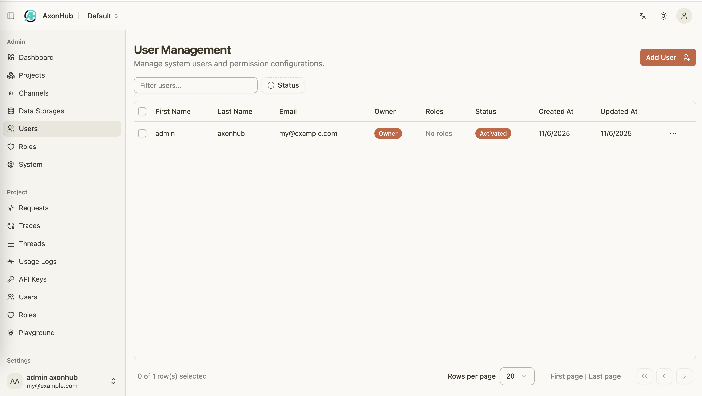
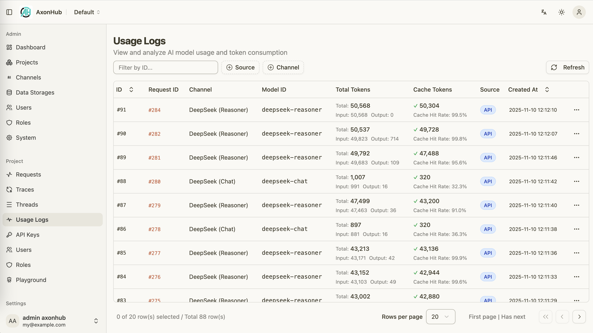
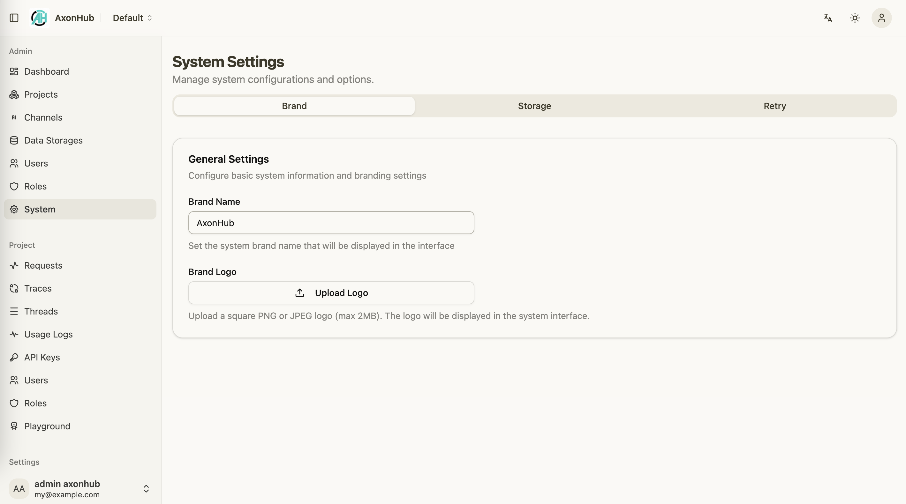

<div align="center">

# AxonHub - All-in-one AI Development Platform

</div>

<div align="center">

[](https://github.com/looplj/axonhub/actions/workflows/test.yml)
[](https://github.com/looplj/axonhub/actions/workflows/lint.yml)
[](https://golang.org/)
[](https://opensource.org/licenses/MIT)
[](https://docker.com)

[English](README.md) | [中文](README.zh-CN.md)

</div>

---

## 📖 Project Introduction

### All-in-one AI Development Platform

AxonHub is an all-in-one AI development platform that provides unified API gateway, project management, and comprehensive development tools. It offers OpenAI, Anthropic, and AI SDK compatible API layers, transforming requests to various AI providers through a transformer pipeline architecture. The platform features comprehensive tracing capabilities, project-based organization, and integrated playground for rapid prototyping, helping developers and enterprises better manage AI development workflows.

<div align="center">
  
</div>

### Core Features

1. [**Unified API**](docs/unified-api.md): OpenAI- and Anthropic-compatible interface with transformer-based model translation lets you swap providers or remap models without code changes.
2. [**Tracing / Threads**](docs/traces.md): Thread-aware tracing captures full request timelines for deep observability and faster debugging.
3. [**Fine-grained Permission**](docs/fine-grained-permission.md): RBAC-based policies help teams govern access, usage, and data segregation precisely.

---

## 📚 Documentation

For detailed technical documentation, API references, architecture design, and more, please visit

- [DeepWiki](https://deepwiki.com/looplj/axonhub).
- [Zread](https://zread.ai/looplj/axonhub).

---

## 🎯 Demo

Try AxonHub live at our [demo instance](https://axonhub.onrender.com)!

**Note**：The demo instance currently configures Zhipu and OpenRouter free models.

### Demo Account

- **Email**: demo@example.com
- **Password**: 12345678

---

## ⭐ Features

### 📸 Screenshots

Here are some screenshots of AxonHub in action:

<table>
  <tr>
    <td align="center">
      <a href="docs/screenshots/axonhub-dashboard.png">
        
      </a>
      <br/>
      System Dashboard
    </td>
    <td align="center">
      <a href="docs/screenshots/axonhub-channels.png">
        
      </a>
      <br/>
      Channel Management
    </td>
    <td align="center">
      <a href="docs/screenshots/axonhub-users.png">
        
      </a>
      <br/>
      User Management
    </td>
  </tr>
  <tr>
    <td align="center">
      <a href="docs/screenshots/axonhub-requests.png">
        
      </a>
      <br/>
      Request Monitoring
    </td>
    <td align="center">
      <a href="docs/screenshots/axonhub-usage-logs.png">
        
      </a>
      <br/>
      Usage Logs
    </td>
    <td align="center">
      <a href="docs/screenshots/axonhub-system.png">
        
      </a>
      <br/>
      System Setting
    </td>
  </tr>
</table>

---

### 🚀 API Types

| API Type             | Status     | Description                    | Document                                     |
| -------------------- | ---------- | ------------------------------ | -------------------------------------------- |
| **Text Generation**  | ✅ Done    | Conversational interface       | [Chat Completions](docs/chat-completions.md) |
| **Image Generation** | ⚠️ Partial | Image generation               | [Image Generations](docs/image-generations.md) |
| **Rerank**           | 📝 Todo    | Results ranking                | -                                            |
| **Embedding**        | 📝 Todo    | Vector embedding generation    | -                                            |
| **Realtime**         | 📝 Todo    | Live conversation capabilities | -                                            |

---

### 🌐 Multi-Provider AI Gateway

| Feature                   | Technical Implementation                        | Business Value                              |
| ------------------------- | ----------------------------------------------- | ------------------------------------------- |
| **Unified API Interface** | OpenAI compatible standard, zero learning curve | Avoid vendor lock-in, reduce migration risk |
| **Automatic Failover**    | Multi-channel retry + load balancing            | Service interruption time < 100ms           |
| **Stream Processing**     | Native SSE support, real-time response          | 60% user experience improvement             |

---

### 🧵 Threads & Tracing

AxonHub records every request as part of a thread-aware trace without requiring you to adopt any vendor-specific SDK. Bring your existing OpenAI-compatible client, and AxonHub will:

- Require incoming `AH-Trace-Id` headers to stitch multiple requests into the same trace. If the header is omitted, AxonHub will still record the request but cannot automatically link it to related activity.
- Link traces to threads so you can follow the entire conversation journey end to end
- Capture model metadata, prompt / response spans, and timing information for fast root-cause analysis

Learn more about how tracing works and how to integrate it in the [Tracing Guide](docs/traces.md).

### 🔧 API Format Support

| Format                      | Status     | Compatibility       | Modalities      |
| --------------------------- | ---------- | ------------------- | --------------- |
| **OpenAI Chat Completions** | ✅ Done    | Fully compatible    | Text, Image     |
| **Anthropic**               | ✅ Done    | Fully supported     | Text            |
| **AI SDK**                  | ⚠️ Partial | Partially supported | Text            |
| **Gemini**                  | 🔄 Todo    | -    | - |

---

### 🏢 Permission Control

| Security Feature                    | Implementation                     |
| ----------------------------------- | ---------------------------------- |
| **Fine-grained Permission Control** | Role-based access control (RBAC)   |
| **Data Localization**               | Configurable data storage policies |
| **API Key Management**              | JWT + scope control                |

---

## 🚀 Quick Start

### 1-click Deploy to Render

Deploy AxonHub with 1-click on [Render](https://render.com) for free.

<div>

<a href="https://render.com/deploy?repo=https://github.com/looplj/axonhub">
  
</a>

</div>

---

## 🚀 Deployment Guide

### 💻 Personal Computer Deployment

Perfect for individual developers and small teams. No complex configuration required.

#### Quick Download & Run

1. **Download the latest release** from [GitHub Releases](https://github.com/looplj/axonhub/releases)

   - Choose the appropriate version for your operating system:

2. **Extract and run**

   ```bash
   # Extract the downloaded file
   unzip axonhub_*.zip
   cd axonhub_*

   # Add execution permissions (only for Linux/macOS)
   chmod +x axonhub

   # Run directly - default SQLite database

   # Install AxonHub to system
   sudo ./install.sh

   # Start AxonHub service
   ./start.sh

   # Stop AxonHub service
   ./stop.sh
   ```

3. **Access the application**
   ```
   http://localhost:8090
   ```

---

### 🖥️ Server Deployment

For production environments, high availability, and enterprise deployments.

#### Database Support

AxonHub supports multiple databases to meet different scale deployment needs:

| Database       | Supported Versions | Recommended Scenario                             | Auto Migration | Links                                                       |
| -------------- | ------------------ | ------------------------------------------------ | -------------- | ----------------------------------------------------------- |
| **TiDB Cloud** | Starter            | Serverless, Free tier, Auto Scale                | ✅ Supported   | [TiDB Cloud](https://www.pingcap.com/tidb-cloud-starter/)   |
| **TiDB Cloud** | Dedicated          | Distributed deployment, large scale              | ✅ Supported   | [TiDB Cloud](https://www.pingcap.com/tidb-cloud-dedicated/) |
| **TiDB**       | V8.0+              | Distributed deployment, large scale              | ✅ Supported   | [TiDB](https://tidb.io/)                                    |
| **Neon DB**    | -                  | Serverless, Free tier, Auto Scale                | ✅ Supported   | [Neon DB](https://neon.com/)                                |
| **PostgreSQL** | 15+                | Production environment, medium-large deployments | ✅ Supported   | [PostgreSQL](https://www.postgresql.org/)                   |
| **MySQL**      | 8.0+               | Production environment, medium-large deployments | ✅ Supported   | [MySQL](https://www.mysql.com/)                             |
| **SQLite**     | 3.0+               | Development environment, small deployments       | ✅ Supported   | [SQLite](https://www.sqlite.org/index.html)                 |

#### Configuration

AxonHub uses YAML configuration files with environment variable override support:

```yaml
# config.yml
server:
  port: 8090
  name: "AxonHub"
  debug: false

db:
  dialect: "tidb"
  dsn: "<USER>.root:<PASSWORD>@tcp(gateway01.us-west-2.prod.aws.tidbcloud.com:4000)/axonhub?tls=true"

log:
  level: "info"
  encoding: "json"
```

Environment variables:

```bash
AXONHUB_SERVER_PORT=8090
AXONHUB_DB_DIALECT="tidb"
AXONHUB_DB_DSN="<USER>.root:<PASSWORD>@tcp(gateway01.us-west-2.prod.aws.tidbcloud.com:4000)/axonhub?tls=true"
AXONHUB_LOG_LEVEL=info
```

For detailed configuration instructions, please refer to [configuration documentation](config.example.yml).

#### Docker Compose Deployment

```bash
# Clone project
git clone https://github.com/looplj/axonhub.git
cd axonhub

# Set environment variables
export AXONHUB_DB_DIALECT="tidb"
export AXONHUB_DB_DSN="<USER>.root:<PASSWORD>@tcp(gateway01.us-west-2.prod.aws.tidbcloud.com:4000)/axonhub?tls=true"

# Start services
docker-compose up -d

# Check status
docker-compose ps
```

#### Virtual Machine Deployment

Download the latest release from [GitHub Releases](https://github.com/looplj/axonhub/releases)

```bash
# Extract and run
unzip axonhub_*.zip
cd axonhub_*

# Set environment variables
export AXONHUB_DB_DIALECT="tidb"
export AXONHUB_DB_DSN="<USER>.root:<PASSWORD>@tcp(gateway01.us-west-2.prod.aws.tidbcloud.com:4000)/axonhub?tls=true"

sudo ./install.sh

# Configuration file check
axonhub config check

# Start service
#  For simplicity, we recommend managing AxonHub with the helper scripts:

# Start
./start.sh

# Stop
./stop.sh
```

---

## 📖 Usage Guide

### 1. Initial Setup

1. **Access Management Interface**

   ```
   http://localhost:8090
   ```

2. **Configure AI Providers**

   - Add API keys in the management interface
   - Test connections to ensure correct configuration

3. **Create Users and Roles**
   - Set up permission management
   - Assign appropriate access permissions

### 2. Channel Configuration

Configure AI provider channels in the management interface:

```yaml
# OpenAI channel example
name: "openai"
type: "openai"
base_url: "https://api.openai.com/v1"
credentials:
  api_key: "your-openai-key"
supported_models: ["gpt-5", "gpt-4o"]
```

#### 2.1 Test Connection

Click the test button. If the test is successful, the configuration is correct.

#### 2.2 Enable Channel

After successful testing, click the enable button to activate the channel.

#### 2.3 Model Mappings

Use model mappings when the requested model name differs from the upstream provider's supported names. AxonHub transparently rewrites the request model before it leaves the gateway.

- Map unsupported or legacy model IDs to the closest available alternative
- Implement failover by configuring multiple channels with different providers

```yaml
# Example: map product-specific aliases to upstream models
settings:
  modelMappings:
    - from: "gpt-4o-mini"
      to: "gpt-4o"
    - from: "claude-3-sonnet"
      to: "claude-3.5-sonnet"
```

> AxonHub only accepts mappings where the `to` model is already declared in `supported_models`.

#### 2.4 Override Parameters

Override parameters let you enforce channel-specific defaults regardless of incoming request payloads. Provide a JSON object that will be merged into every outbound request.

- Supports top-level settings (for example `temperature`, `max_tokens`, `top_p`)
- Supports dot-notation keys for nested fields such as `response_format.type`
- Invalid JSON logs a warning and falls back to the original payload

```yaml
# Example: enforce deterministic JSON responses
settings:
  overrideParameters: |
    {
      "temperature": 0.3,
      "max_tokens": 1024,
      "response_format.type": "json_object"
    }
```

### 3. Add Users

1. Create user accounts
2. Assign roles and permissions
3. Create API keys

### 4. Claude Code/Codex Integration

See the dedicated [Claude Code & Codex Integration Guide](docs/claude-code-integration.md) for detailed setup steps, troubleshooting, and tips on combining these tools with AxonHub model profiles. 

---

### 5. SDK Usage

#### Python SDK

```python
from openai import OpenAI

client = OpenAI(
    api_key="your-axonhub-api-key",
    base_url="http://localhost:8090/v1"
)

response = client.chat.completions.create(
    model="gpt-4o",
    messages=[{"role": "user", "content": "Hello!"}]
)
print(response.choices[0].message.content)
```

#### Node.js SDK

```javascript
import OpenAI from "openai";

const openai = new OpenAI({
  apiKey: "your-axonhub-api-key",
  baseURL: "http://localhost:8090/v1",
});

const completion = await openai.chat.completions.create({
  messages: [{ role: "user", content: "Hello!" }],
  model: "gpt-4o",
});
```

## 🛠️ Development Guide

For detailed development instructions, architecture design, and contribution guidelines, please see [DEVELOPMENT.md](DEVELOPMENT.md).

---

## 🤝 Acknowledgments

- 🙏 [musistudio/llms](https://github.com/musistudio/llms) - LLM transformation framework, source of inspiration
- 🎨 [satnaing/shadcn-admin](https://github.com/satnaing/shadcn-admin) - Admin interface template
- 🔧 [99designs/gqlgen](https://github.com/99designs/gqlgen) - GraphQL code generation
- 🌐 [gin-gonic/gin](https://github.com/gin-gonic/gin) - HTTP framework
- 🗄️ [ent/ent](https://github.com/ent/ent) - ORM framework
- 🔧 [air-verse/air](https://github.com/air-verse/air) - Auto reload Go service
- ☁️ [Render](https://render.com) - Free cloud deployment platform for hosting our demo
- 🗃️ [TiDB Cloud](https://www.pingcap.com/tidb-cloud/) - Serverless database platform for demo deployment

---

## 📄 License

This project is open source under the MIT License. See [LICENSE](LICENSE) file for details.

---

<div align="center">

**AxonHub** - All-in-one AI Development Platform, making AI development simpler

[🏠 Homepage](https://github.com/looplj/axonhub) • [📚 Documentation](https://deepwiki.com/looplj/axonhub) • [🐛 Issue Feedback](https://github.com/looplj/axonhub/issues)

Built with ❤️ by the AxonHub team

</div>
