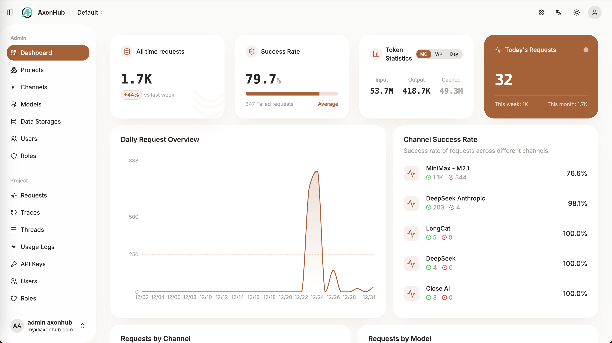
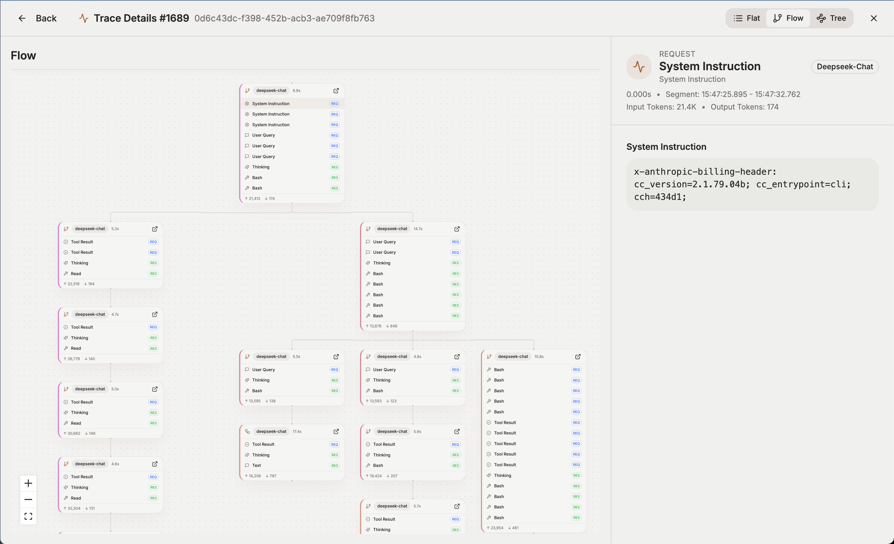
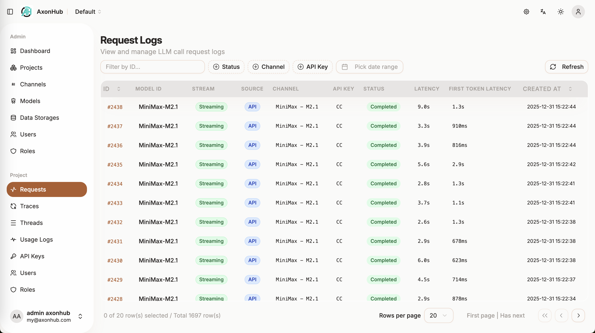
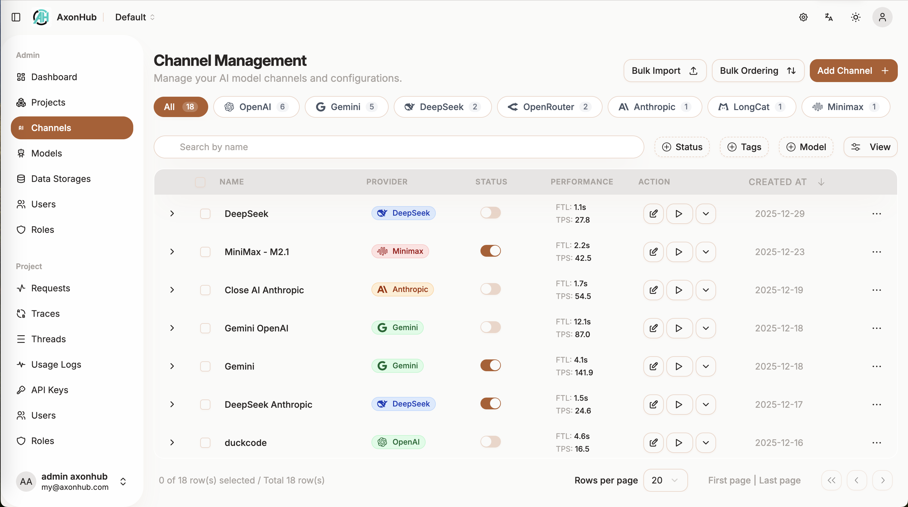
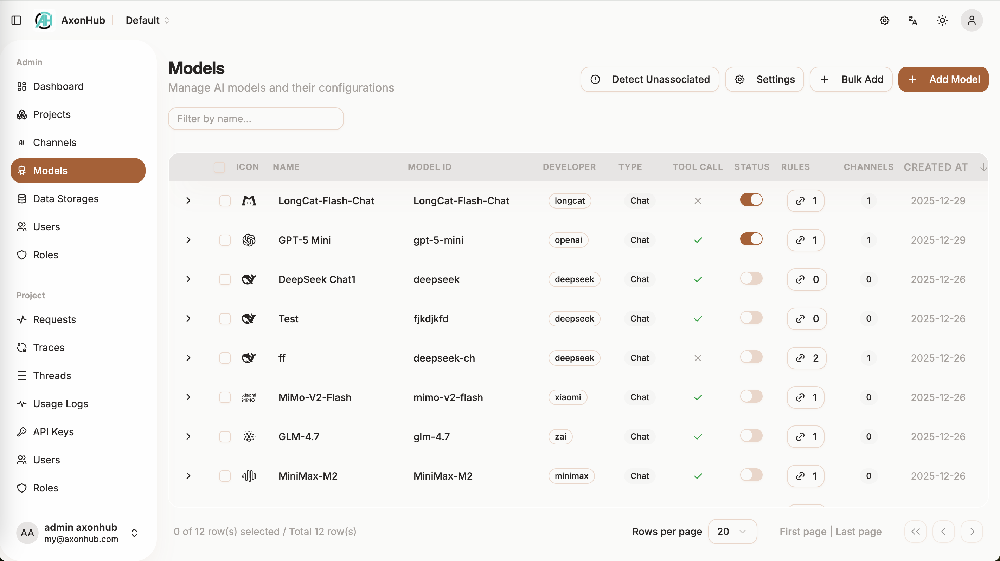
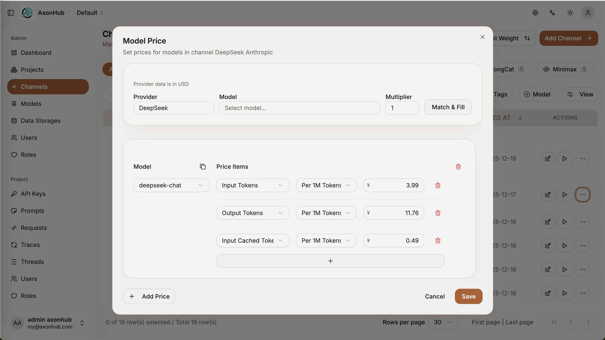

<div align="center">

# ⚡️ AxonHub - The Open-Source AI Gateway

**Unify 100+ LLM APIs with a single, OpenAI-compatible endpoint. Built for performance, reliability, and cost management.**

</div>

<div align="center">

[](https://github.com/looplj/axonhub/actions/workflows/test.yml)
[](https://github.com/looplj/axonhub/actions/workflows/lint.yml)
[](https://golang.org/)
[](https://hub.docker.com/r/looplj/axonhub)
[](https://github.com/looplj/axonhub/stargazers)

[English](README.md) | [中文](README.zh-CN.md)

</div>

---

AxonHub is an all-in-one AI development platform that provides a unified API gateway, project management, and comprehensive development tools. It offers OpenAI, Anthropic, and AI SDK compatible API layers, transforming requests to various AI providers through a transformer pipeline architecture. The platform features comprehensive tracing capabilities, project-based organization, and an integrated playground for rapid prototyping, helping developers and enterprises better manage AI development workflows.

<div align="center">
  
</div>

---

## 🚀 Quick Start

Get AxonHub running in under a minute.

```bash
# 1. Run with Docker
docker run -d -p 8090:8090 --name axonhub -v ~/.axonhub:/data looplj/axonhub:latest

# 2. Access the dashboard
# Open http://localhost:8090
```

Now, use the `openai` SDK with your AxonHub endpoint:

```python
import openai

client = openai.OpenAI(
    base_url="http://localhost:8090/v1",
    api_key="YOUR_AXONHUB_API_KEY", # Create one in the dashboard
)

response = client.chat.completions.create(
    model="gpt-4", # This will be routed to the channel you configure
    messages=[{"role": "user", "content": "Hello, world!"}]
)

print(response)
```

---

## 🤔 Why AxonHub?

In a world with hundreds of LLM providers, building robust AI applications is complex. AxonHub simplifies this by providing a single, consistent interface for all your AI needs.

- ✅ **Avoid Vendor Lock-in**: Switch between OpenAI, Anthropic, Google, and others with zero code changes.
- 💰 **Control Costs**: Real-time cost tracking, caching, and budget enforcement to prevent surprise bills.
- 🚀 **Boost Performance**: Adaptive load balancing and automatic retries ensure your application is fast and reliable.
- 🛡️ **Enterprise-Grade Security**: Fine-grained access control (RBAC) and project-based data segregation.
- 🔎 **Deep Observability**: End-to-end tracing of every request without vendor-specific SDKs.

---
## ✨ Core Features

| Feature                   | Description                                                                                             |
| ------------------------- | ------------------------------------------------------------------------------------------------------- |
| **Unified API Interface** | Use a single OpenAI-compatible API to access 100+ models from providers like Anthropic, Google, and more. |
| **Adaptive Load Balancing** | Intelligent routing based on health, performance, and session consistency to ensure optimal uptime.       |
| **End-to-End Tracing**    | Thread-aware tracing for deep observability and faster debugging without vendor-specific SDKs.          |
| **Real-time Cost Tracking** | Precise cost calculation and budget management for every request, preventing surprise bills.              |
| **Fine-grained Permissions**| RBAC policies to govern access, usage, and data segregation for teams of any size.                      |

### 📸 Screenshots

<table>
  <tr>
    <td align="center">
      <a href="docs/screenshots/axonhub-dashboard.png">
        
      </a>
      <br/>
      System Dashboard
    </td>
    <td align="center">
      <a href="docs/screenshots/axonhub-trace.png">
        
      </a>
      <br/>
      Trace Viewer
    </td>
    <td align="center">
      <a href="docs/screenshots/axonhub-requests.png">
        
      </a>
      <br/>
      Request Monitoring
    </td>
  </tr>
  <tr>
  <td align="center">
      <a href="docs/screenshots/axonhub-channels.png">
        
      </a>
      <br/>
      Channel Management
    </td>
    <td align="center">
      <a href="docs/screenshots/axonhub-models.png">
        
      </a>
      <br/>
      Model & Channel Routing
    </td>
    <td align="center">
      <a href="docs/screenshots/axonhub-model-price.png">
        
      </a>
      <br/>
      Model Pricing
    </td>
  </tr>
</table>

---
## 🚀 Deployment

AxonHub can be deployed anywhere, from your local machine to the cloud.

### 1-Click Deploy

Deploy AxonHub with a single click on [Render](https://render.com) for free.

[](https://render.com/deploy?repo=https://github.com/looplj/axonhub)

### Docker

For personal and server deployments, Docker is the recommended method.

```bash
# Run AxonHub with a persistent volume
docker run -d -p 8090:8090 --name axonhub -v ~/.axonhub:/data looplj/axonhub:latest
```

For more advanced deployment options, including Docker Compose and Kubernetes, check out our [Deployment Guide](docs/en/deployment/configuration.md).

---

## 📚 Documentation

Our comprehensive documentation is the best place to learn about AxonHub's features and architecture.

- [**DeepWiki**](https://deepwiki.com/looplj/axonhub): Detailed technical documentation, API references, and architecture design.
- [**Zread**](https://zread.ai/looplj/axonhub): Ask questions and get answers about AxonHub from our AI-powered assistant.

---

## 🤝 Community & Support

Join our community to get help, share ideas, and contribute to the future of AxonHub.

- [**GitHub Issues**](https://github.com/looplj/axonhub/issues): Report bugs and request features.
- [**GitHub Discussions**](https://github.com/looplj/axonhub/discussions): Ask questions and share your projects.

---

## 📄 License

This project is licensed under the Apache-2.0 License. See the [LICENSE](LICENSE) file for details.
