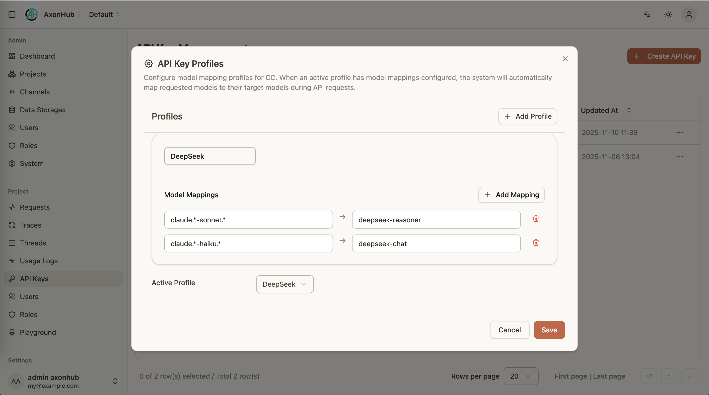

# Codex 集成指南

---

## 概览
AxonHub 可以作为 OpenAI 接口的直接替代方案，使 Codex 能够通过您自己的基础设施连接。本文将介绍配置方法，并说明如何结合 AxonHub 的模型配置文件功能实现灵活路由。

### 关键点
- AxonHub 支持多种 AI 协议/格式转换。你可以配置多个上游渠道（provider/channel），对外提供统一的 OpenAI 兼容接口，供 Codex 使用。
- 你可以开启 `server.trace.codex_trace_enabled`（使用 `Session_id`）或配置 `server.trace.extra_trace_headers` 将 Codex 同一次对话的请求聚合到同一条 Trace。

### 前置要求与 AxonHub 设置
- 开发机可以访问 AxonHub 实例。
- 拥有项目访问权限的 AxonHub API Key。
- 可以使用 Codex（OpenAI 兼容工具）。
- AxonHub 中已有一个 Codex 渠道。该渠道提供上游地址、凭据和 HTTP 传输配置。

配置 Codex 前，请在 AxonHub 的 **Codex 兼容**设置页中：

1. 开启兼容开关。
2. 选择用于原生模型目录的 Codex 渠道。
3. 点击渠道的**测试**按钮，确认其 `/models` 接口可访问。测试不会保存设置、启用渠道或修改渠道状态。

兼容开关默认关闭。保存开启的配置时必须选择一个现存 Codex 渠道。即使开关关闭，也可以执行目录测试；测试失败不会阻止保存。目录结果只会过滤为当前调用者可见的模型；这不等于允许手工指定该模型，推理请求仍由现有权限链路检查。

### 配置 Codex 认证与路由
1. 编辑 `${HOME}/.codex/auth.json`，将 AxonHub API Key 作为 Codex personal access token 保存。请只使用此文件，不要使用 `CODEX_ACCESS_TOKEN`、`login --with-access-token` 或 `api_key` auth mode：
   ```json
   {"personal_access_token":"<your-axonhub-api-key>"}
   ```
2. 编辑 `${HOME}/.codex/config.toml`，让 provider 和认证 API 都指向同一个 `/codex` 兼容入口：
   ```toml
   model = "gpt-5"
   model_provider = "openai"
   openai_base_url = "https://gateway.example/codex"
   chatgpt_base_url = "https://gateway.example/codex"
   ```
3. 在启动 Codex 的同一个 shell 中设置必需的认证 API 地址：
   ```bash
   export CODEX_AUTHAPI_BASE_URL="https://gateway.example/codex"
   ```
   将示例主机替换为你的 AxonHub 地址。不要设置独立的目录 URL；whoami、models 和 Responses 请求都使用 `/codex` 入口。
4. 重启 Codex 以加载配置。

本指南使用的兼容入口如下：

- `GET /codex/v1/user-auth-credential/whoami`：本地 API Key 身份信息。
- `GET /codex/models`：选定渠道的原生目录与调用者可见模型 ID 的交集。
- `POST /codex/responses`：Responses HTTP/SSE 推理。
- `GET /codex/responses`：Responses WebSocket 推理。

#### 按对话聚合 Trace（重要）
开启内置 Codex 追踪提取后，AxonHub 会将 `Session_id` header 作为 trace ID 使用：

```yaml
server:
  trace:
    codex_trace_enabled: true
```

若 Codex 还会携带其他稳定的对话标识 header（例如 `Conversation_id`），可在 `config.yml` 中将其加入 `extra_trace_headers`，用于在主 trace header 缺失时进行聚合：

```yaml
server: 
  trace:
    extra_trace_headers:
      - Conversation_id
```

**提示**：开启此功能后，AxonHub 会将同一个 Trace 的请求优先转发到同一个上游渠道，从而大幅提高提供商端的缓存命中率（例如 Anthropic 的 Prompt Caching）。

#### 验证
- 启动 Codex 并发送测试 Prompt，AxonHub 日志中应出现 `/codex/responses`。
- 确认模型列表从 `/codex/models` 加载，且选定渠道仍可用于推理。
- 启用 AxonHub 的追踪功能可查看提示词、回复及延迟信息。

PR1 的远程 compaction-v2 复用普通 Responses 路径：向 `/codex/responses` 发送 `compaction_trigger`，再把返回的压缩项用于后续 Responses 请求。PR1 不实现 alpha history/notes API，不新增独立的 `/codex/responses/compact` 路由，也不宣称完整支持 context management；这些未支持路径返回 JSON 404。既有 `/v1` 路由保持不变。

### 使用模型配置文件
AxonHub 的模型配置文件支持将请求模型映射到具体提供商模型：
- 在 AxonHub 控制台创建配置文件并添加映射规则（精确名称或正则）。
- 将配置文件绑定到 API Key。
- 切换活动配置文件即可更改 Codex 的行为，无需调整本地工具设置。

<table>
  <tr align="center">
    <td align="center">
      <a href="../../screenshots/axonhub-profiles.png">
        
      </a>
      <br/>
      Model Profiles
    </td>
  </tr>
</table>

#### 示例
- 请求 `gpt-4` → 映射到 `deepseek-reasoner` 以获取更准确的回复。
- 请求 `gpt-3.5-turbo` → 映射到 `deepseek-chat` 以降低成本。

### 常见问题
- **Codex 认证失败**：确认 `${HOME}/.codex/auth.json` 的 `personal_access_token` 是有效的 AxonHub API Key，并确认 `CODEX_AUTHAPI_BASE_URL`、`openai_base_url` 和 `chatgpt_base_url` 指向同一个 `/codex` 入口。
- **模型列表为空或不可用**：确认兼容开关已开启、已选择 Codex 渠道，且该渠道的 `/models` 接口通过设置页测试。目录过滤不代替推理授权。
- **模型结果异常**：检查 AxonHub 控制台中当前启用的配置文件映射，必要时禁用或调整规则。

### 相关文档
- [追踪指南](tracing.md)
- [OpenAI API 文档](../api-reference/openai-api.md)
- README 中的 [使用指南](../../../README.md#使用指南--usage-guide)
